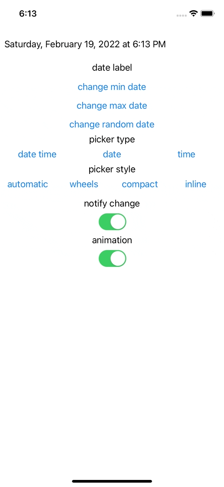

# LXKDateTimePickerLabel

A label which let you display date and open datepicker on click, support custom format and safe fallback for date timepicker style



## Installation

### CocoaPods

```swift
pod 'LXKDateTimePickerLabel', :git => "https://github.com/LeXuanKhanh/LXKDateTimePickerLabel.git"
```

## Requirements

- iOS 10.0

- Xcode 11

- Swift 5.0+
